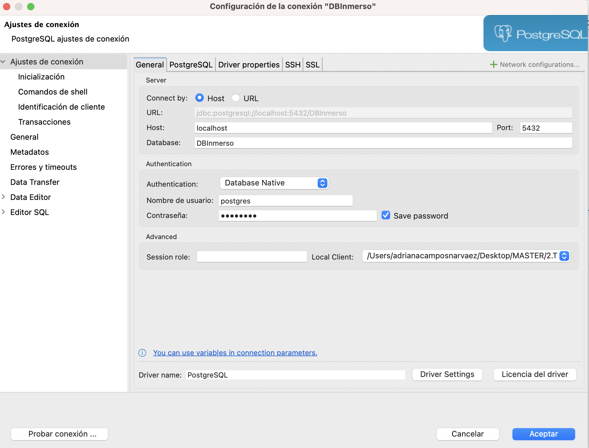

# BBDD Imserso 

## Procedimiento de Configuración de la Base de Datos: Detalles sobre la Implementación

 En este readme vamos a explicar, de forma detallada, los pasos que seguimos durante el desarrollo del proyecto. Primero creamos la base de datos, insertamos los datos de en las tablas. Luego ejecutamos nuestro algoritmo diseñado para realizar el sorteo, aplicando la lógica necesaria para determinar quiénes serán los beneficiarios del programa IMSERSO. Por último, culminamos el proceso eligiendo las personas que podrán disfrutar de los beneficios del IMSERSO.

    

En primer lugar, llevamos a cabo la creación de una base de datos utilizando **PostgreSQL**. Este proceso inicial fue fundamental para establecer el entorno de almacenamiento de datos necesario para nuestro proyecto, el nombre de la bbdd es DBInmerso, el usuarioes postgres y la psw postgres. Asimismo, los detalles de como levantamos esta base de datos esta en el archivo **docker-compose.yml**.

En segundo lugar, creamos las tablas en la base de datos, el archivo que contiene estas tablas es **init.sql**, y creamos el script **fill_data_script.py** donde usamos las bibliotecas Faker y Random para rellenar la tabla. Faker una biblioteca de Python que se utiliza para generar datos ficticios de manera rápida y sencilla para rellenar la tabla y Random proporciona funciones para trabajar con números aleatorios.

En tercer lugar, realizamos un pequeño análisis estadístico con ***notebooks*** para saber si nuestro algoritmo era justo, ver cantidad de personas que participaban, edad media, lugares donde la gente quería viajar, normalizamos las variables. El archivo donde se encuentra toda esta información es **scoring_jupyter.ipynb**. Al final de este archivo vemos que hay un comando que exporta **scoring.py** y es lo que realmente nos sirve para insertar los datos dentro de la tabla scoring.

Por ultimo, realizamos una visualización de datos con **Tableau**.

# ¿Como se ejecuta el código?
 
1. Se debe clonar este repositorio. 

2. Se pone en el terminal el código que escribimos a continuación.
   
   `docker-compose up`

3. Una vez ejecutado podoemos ir viendo en el terminal como avanza, y lo que esta ejeuctando en cada momento. 
   
4. Desde DBeaver introducimos nuestra base de datos. Las indicaciones se pueden ver en la imagen adjunta:

    

4. En la base de datos podemos observar las tablas y el modelo relacional.

